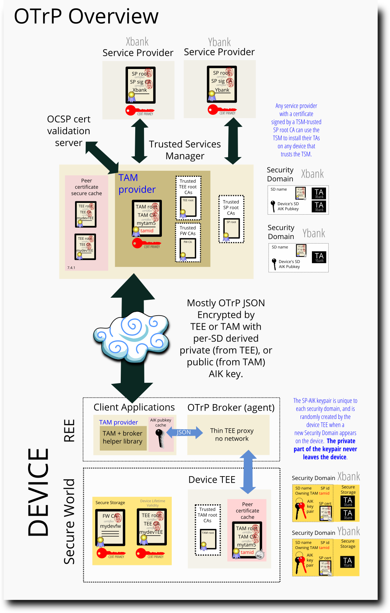
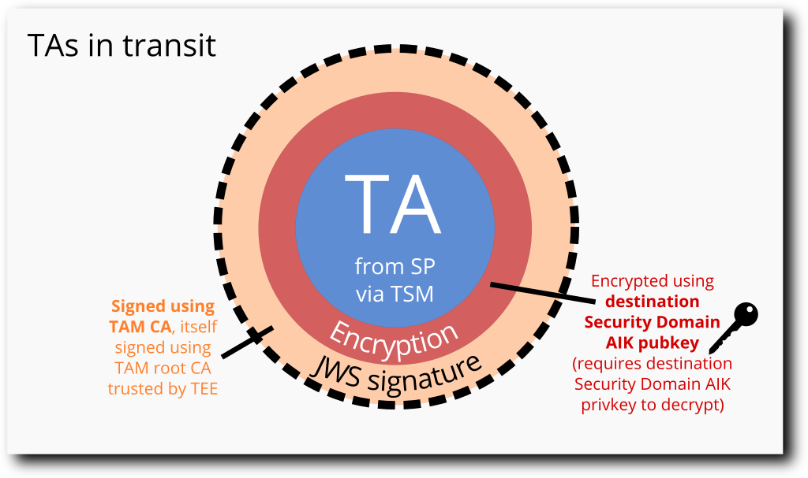
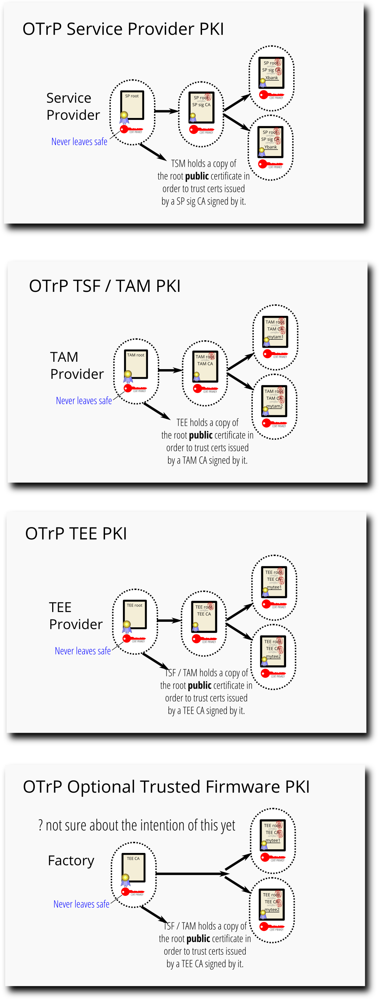

# OTrP Overview

## Normative docs

 - [OTrP draft RFC](https://datatracker.ietf.org/doc/draft-ietf-teep-opentrustprotocol/?include_text=1)
 - [globalplatform GPD TMF OTrP profile (public review v0.0.0.21)](https://globalplatform.org/wp-content/uploads/2018/11/GPD_TMF_OTrP_Profile_v0.0.0.21_PublicReview.pdf)
 - [JWS RFC7515](https://tools.ietf.org/html/rfc7515)
 - [JWE RFC7516](https://tools.ietf.org/html/rfc7516)
 - [JWK RFC7517](https://tools.ietf.org/html/rfc7517)
 - [JWA RFC7518](https://tools.ietf.org/html/rfc7518)

## Working overview diagram

## 10000m view

OTrP can be understood as existing to fix two limitations with the
GlobalPlatform TEE definition:

 1. The TAs are not encrypted, just signed.  So they cannot contain secrets
    as it is.

 2. There is only one valid signing key defined at TEE build-time.  Nobody
    without the key can make insertable TAs and anybody with the key can
    build TAs to insert on any device with that build of the TEE.

Everything about the architecture of OTrP has fallen out of fixing those
two restrictions.

 - To solve TA encryption, they are encrypted by a remote provider (the
   "Trusted Services Manager" or TSM) using a public key held by the targeted
   device specifically, before transmission to the device.  They may be stored
   with the encryption intact and the decrypted and confirmed on insertion.

 - So one provider can't snoop the TAs of another, there are separate
   keypairs derived on the device per provider (held in a Security Domiain (SD)
   per- "Service Provider" (SP)

 - A new TA insertion method is implied on the TEE-side that decrypts "installed"
   TAs and inserts them after confirming decryption, without checking for the
   old build-time trusted signature.

 - A granular PKI is defined using X.509 certs that allows the remote Trusted
   Services Manager (TSM) to confirm if it is talking to something with access
   a TEE certificate on the other side.  The TEE side holds a list of TSM
   certifcates it is willing to trust and can confirm the packets it is receiving
   came from something with access to one of those.

 - The client application initiates most activities, and includes a library that
   deals with network connectivity.  However almost all of the traffic passing
   through the client application and the OTrP broker has a payload encrypted with
   keys unavailable to either the client application or the OTrP broker.  The
   Trusted Services Manager (TAM) and the TEE side are the two endpoints for the
   encrypted communication that have the necessary keys to see plaintext.

 - Network-traversing packets are placed in a "Flattened JSON" JWS signed wrapper.
   JWS payload that fails the signature check is discarded without being processed,
   making it difficult to trigger bugs or corner cases by fuzzing type attacks or
   targeted hacks like buffer overflows.

## TA Encryption

## OTrP PKI

