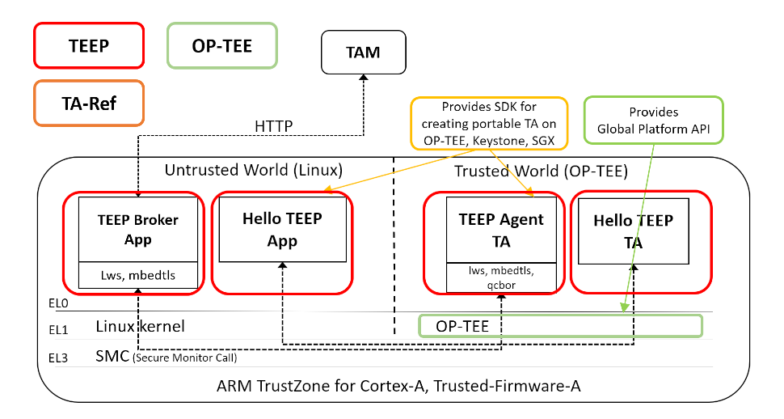
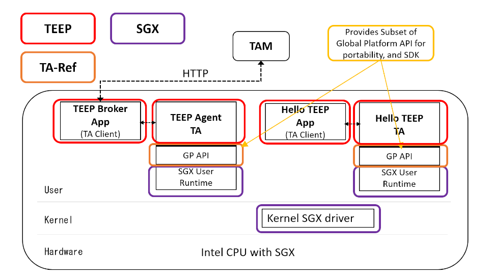

# Overview of TEEP-Device

The TEEP Protocol provides the protocol on a wide range of devices for install, update, and delete Trusted Applications and Personalization Data by Trusted Component Signer or Device Administrators who host Trusted Application Managers (TAMs).


The TEEP-Device is an implementation for defining the draft of Trusted Execution Environment Provisioning (TEEP) Protocol at the Internet Engineering Task Force (IETF). The chart above is a simplified diagram of components described in the TEEP Protocol and TEEP Architecture drafts. The TEEP Protocol on the TEEP-Device uses HTTP packets defined by HTTP Transport for Trusted Execution Environment Provisioning.

Following are the explanations of each component on the above diagram.

Trusted Application (TA): An application that runs in a TEE.

Trusted Application Manager (TAM): An entity that manages Trusted
      Applications and other Trusted Components running in TEEs of
      various devices.

TEEP Broker: A TEEP Broker is an application component running in
      a Rich Execution Environment (REE) that enables the message
      protocol exchange between a TAM and a TEE in a device.  A TEEP
      Broker does not process messages on behalf of a TEE, but merely is
      responsible for relaying messages from the TAM to the TEE, and for
      returning the TEE's responses to the TAM.

TEEP Agent: The TEEP Agent is a processing module running inside a
      TEE that receives TAM requests (typically relayed via a TEEP
      Broker that runs in an REE).  A TEEP Agent in the TEE may parse
      requests or forward requests to other processing modules in a TEE,
      which is up to a TEE provider's implementation.

The terminology of Trusted Application (TA) in the old draft was revised to Trusted Component (TC) to express the files installed from TAM to devices that could have both binaries of trusted applications and data files of personalization data. The TA and TC are interchangeable in this documentation.

The TEEP Protocol relies on the Software Updates for Internet of Things (SUIT) Manifest defined at IETF which expresses metadata of the TC. When the TAM sends one of the TEEP Messages called Update Message, it will include SUIT Manifest for installing TC to the Device.

The TEEP Protocol and SUIT Manifest are both in binary formats of Concise Binary Object Representation (CBOR). The Objective of CBOR is designed to reduce the message size as much as possible in the way of light way parsing which is appropriate for Constraint Hardware such as IoT, Edge and Embedded devices with limited CPU processing power and memory size. The CBOR has a similar representation of JSON that is widely used on the Internet and makes constructing CBOR easier to use.

The authentication feature of CBOR binaries in TEEP Messages and SUIT Manifests is proved by CBOR Object Signing and Encryption (COSE) required by TAM, Device, Developer and Owner of TC and etc. The COSE defined the method of Signing and Encryption of CBOR formats.

More details can be found in the URLs at iETF.
- TEEP Protocol
  * https://datatracker.ietf.org/doc/html/draft-ietf-teep-protocol
- HTTP Transport for Trusted Execution Environment Provisioning
  * https://datatracker.ietf.org/doc/html/draft-ietf-teep-otrp-over-http
- TEEP Architecture:
  * https://datatracker.ietf.org/doc/draft-ietf-teep-architecture/
- SUIT Manifest:
  * https://datatracker.ietf.org/doc/draft-ietf-suit-manifest/
- CBOR
  * https://datatracker.ietf.org/doc/rfc8949/
- COSE
  * https://datatracker.ietf.org/doc/rfc8152/

## Use Cases of TEEP

Typical use cases for TEEP Protocol is a firmware update Over The Air (OTA) which TC containing a firmware binary, installing security sensitive applications used for payment, playing video with DRM, insurance software, enabling hardware feature with license keys, telemetry software, and softwares handles personal identification data, such as Social Security Number, and vaccination status.

## Features of TEEP-Device

- The TEEP Protocol defines the protocol format and interaction between the server called Trusted Application Managers (TAM) and the IoT/Edge devices. The TEEP-Device is an implementation of Trusted Execution Environment Provisioning (TEEP) Protocol on the IoT/Edge devices.

- The TEEP-Device provides the requirements of the TEEP-Broker and TEEP-Agent in IETF drafts.

- Uses the tamproto as an implementation of the TAM server.
  * https://github.com/ko-isobe/tamproto

- Provides initiating the protocol from TEEP-Device, downloading a Trusted Components (TC) called Hello-TEEP-TA as a sample of TC from the TAM, installing it inside TEE, and executing the Hello-TEEP-TA.

- Implemented on top of TA-Ref which provides a portable TEE programming environment among different TEEs on Intel CPU, ARM Cortex-A and RISC-V 64G to provide uniform source codes over OP-TEE on ARM-TrustZone for Cortex-A series and Keystone on RISC-V.

- The required features of TEEP-Agent in the draft is implemented as a application in user application privilege level inside TEE in this TEEP-Device to simplify the implementation which ideally should be combined with implementation in higher privilege levels, such as, the runtime in S-Mode and Secure Monitor in M-mode on RISC-V. Therefore, some of the assumed requirements on the draft are not fulfilled with the TEEP-Device. In the product, the features of TEEP-Agent must be enabled through root-of-trust from the boot up of the CPUs, the TCs must be saved in a secure manner and have protection of installed TCs.

- Supports Concise Binary Object Representation (CBOR) for current four TEEP Messages.
  * https://datatracker.ietf.org/doc/html/rfc7049

- Supports SUIT Manifest inside the Update message of TEEP Protocol.
  * https://datatracker.ietf.org/doc/draft-ietf-suit-manifest/

## Components of TEEP-Device and TA-Ref

The Trusted Application Reference (TA-Ref) is a different software stack from this TEEP-Devie. The TA-Ref provides a portable API and SDK among Intel SGX, ARM TrustZone-A and RISC-V Keystone and enables portability for source codes of Trusted Applications among different CPUs.

The API of TA-Ref is a subset of TEE Internal Core API Specification defined by Global Platform.
 - https://globalplatform.org/specs-library/tee-internal-core-api-specification/

### TEEP-Device and TA-Ref Components on Keystone


The TEEP-Device is implemented on top of the TA-Ref with TEE provided by the Keystone project on RISC-V RV64GC CPU. Each TA in the Trusted Area is protected with Physical memory protection (PMP) which is enabled by RISC-V hardware.

- Keystone project
  * https://keystone-enclave.org/

### TEEP-Device and TA-Ref Components on OP-TEE



It is on OP-TEE but highly utilizes the programming environment provided by TA-Ref to simplify the TEEP-Device to be able to build and function on other CPUs with the single source code of TEEP-Agent and Hello-TEEP-TA. They both are using the subset of Global Platform API.

### TEEP-Device and TA-Ref Components on SGX



The diagram is the ideal implementation of TEEP-Device on SGX. The current TEEP-Device is not utilizing SGX libraries and the SGX enabled CPU which provides SGX capability with SGX SDK. The TEEP-Device is built and executed as a regular user space application at the moment, and enabling the SGX capability is a future activity.
# Directory structure of source files

Following are the important directories in the source code along with its description

| Directory| Description|
| ------ | ------ |
| docs | Files for generating documentaions |
| hello-tc | Sample Trusted Application for TEEP Protocol |
| include | Header files to build hello-app/ta and teep-broker-app/teep-agent-ta | 
| key | cryptograpic keys for TEEP protocol |
| lib | contains libraries used on TEEP-Device |
| submodules |Contains the submodules used for TEEP-Device |
| submodules/libwebsockets | HTTP/HTTPS library https://github.com/warmcat/libwebsockets |
| submodules/mbedtls | Cryptographic library  https://github.com/ARMmbed/mbed-crypto |
| submodules/QCBOR | CBOR library  https://github.com/laurencelundblade/QCBOR.git |
| submodules/t_cose | COSE library  https://github.com/laurencelundblade/t_cose.git |
| teep-agent-ta | Main body of handling TEEP Protocol on TEE side |
| teep-broker-app | Main body of handling TEEP Protocol on Linux side |

**TEEP-Device Source Code**

The below is the current TEEP-Device source code listing only the directories to one level.


```sh
.
  |-teep-broker-app
  |  |-scripts
  |-hello-tc
  |  |-build-keystone
  |  |-build-sgx
  |  |-manifest
  |  |-build-optee
  |  |-build-pc
  |-lib
  |  |-suit
  |  |-cbor
  |  |-include
  |  |-teep
  |  |-cose
  |  |-log
  |-platform
  |  |-pc
  |  |-keystone
  |  |-sgx
  |  |-op-tee
  |-sample
  |  |-session
  |-key
  |  |-CAs
  |-docs
  |  |-images
  |  |-doxygen
  |  |-teep-device_readme_html
  |-include
  |-submodule
  |  |-mbedtls
  |  |-t_cose
  |  |-libwebsockets
  |  |-QCBOR
  |  |-googletest
  |-teep-agent-ta
```
# Consideration of build machine and development environment

## How to select the build machine

It is essential to have a fast machine as much as possible for building the sources and using multiple terminals for efficient development.
Selection of a fast computer is mandatory because the speed of the build machine affects the efficiency of the development.

More Often developers using a laptop, are logging in to a fast remote computer and building the sources on the remote machine rather then on a local laptop.

The three key components of the fast-build machine are CPU, storage, and memory size. T
The laptop will be slower than the server or desktop machine because of the limited capability of the three key components.

The frequency of the CPU is above 3.8Ghz is ideal. The write speed of the storage has a significant impact on the build time. It is almost a must to use SSD than HDD and the SSD should be above 3000MB/s write speed which is only available with M.2 form factor with NVMe interface. The 32GB or higher memory size is recommended, since it will prevent disk swapping when running out of memory, significantly reducing the build speed. Please request reasonable development machines if you are working at a corporate or organization.

Some Examples of high-end machines: HPE ProLiant DL325 Gen10 with AMD EPYC 7302P 16-Core Processor, PowerEdge R7515 with AMD EPYC 7402P 24-Core Processor

## How to setup an efficient development environment

To efficiently develop TEEP-Device source code, it is good to have three terminals.

- Terminal 1: To Run tamproto
- Terminal 2: To build and run the TEEP-Device.
- Terminal 3: To modify the TEEP-Device source code.

All three terminals opened simultaneously for efficiency. Logging in to the fast build machines mentioned in the previous chapter with the command `ssh -X user@Ip_address_build_machine` will provide forwarding X-Windows on your local machine.


In the above image, you can see that terminal1 is running tamproto, terminal2 is used for building and running TEEP-Device to catch the build errors and runtime errors. The terminal3 is used for editing the source code for debugging the errors found on terminal 2 and terminal 1. At the terminal 3, use your favorite editor or IDE such as Visual Studio Code.

Every time you update the source code in terminal 3, you can rebuild the source code on terminal2 and run it and see the debug messages of TEEP-Device at terminal 2 and logs message of tamproto at terminal 1 to find the eros whiteout distracted from other terminals.

The 27 inch or larger external monitor would suit best to operate multiple terminals during developments in this usage. The selection of the resolution is also important, not too dense and not too sparse.  The 2560 x 1440 is often ideal on a 27 inch monitor, and 4K 3840 x 2160 on a 32 inch. Having more text on one display increases readability of the source code, as long as the size of the character is not too small.

# Build TEEP-Device with Docker

The benefit of Docker images is to provide the environment of building and developing TEEP-Device to reduce the overhead of preparing them individually.

The TEEP-Device requires TA-Ref which provides a unified SDK among different TEEs for three CPU architectures, Keystone for RISC-V, OP-TEE for Arm64 and SGX for Intel.

Without the prepared Docker images, the developer will be required to build a massing software stack of Keystone, OP-TEE and SGX and install them on his/her development machine which needs downloading large sizes of source codes, a long time for building them. Also it may result in every individual having a slightly different environment which makes it difficult to reproduce when encountering errors.

The Docker images provide an easy to prepare development environment for TEEP-Device.


## Preparation for Docker

To build the TEEP-Device with Docker, it is required to install Docker on Ubuntu.

For the first time users of Docker, please have a look on https://docs.docker.com/engine/.

The following installation steps is for Ubuntu 20.04

### Install Docker

```sh
$ sudo apt update

# Next, install a few prerequisite packages which let apt use packages over HTTPS:
$ sudo apt install apt-transport-https ca-certificates curl software-properties-common

# Then add the GPG key for the official Docker repository to your system:
$ curl -fsSL https://download.docker.com/linux/ubuntu/gpg | sudo apt-key add -

# Add the Docker repository to APT sources:
$ sudo add-apt-repository "deb [arch=amd64] https://download.docker.com/linux/ubuntu focal stable"

# This will also update our package database with the Docker packages from the newly added repo.
# Make sure you are about to install from the Docker repo instead of the default Ubuntu repo:
$ apt-cache policy docker-ce

#Finally, install Docker
$ sudo apt install docker-ce docker-compose
```

### Executing Docker without sudo

By default, the Docker command can only be run by the root user or by a user in the Docker group, which is automatically created during Docker's installation process. If you attempt to run the Docker command without prefixing it with sudo or without being in the Docker group, you will get an output like this:

```console
docker: Cannot connect to the Docker daemon. Is the docker daemon running on this host?.
```

To avoid typing sudo whenever we run the docker command, add your username to the docker group.

```sh
$ sudo groupadd docker

$ sudo gpasswd -a $USER docker

# Logout and then log-in again to apply the changes to the group
 ```

After you logout and login, you can probably run the Docker command without `sudo`.

```sh
$ docker run hello-world
```

Login to the docker to be able to access docker images.
Make sure you have an account on docker-hub. If not please create one on `dockerhub.com`.

```sh
$ docker login -u ${YOUR_USERNAME} -p ${YOUR_PASSWD}
```

### Create a Docker network tamproto

A Docker network named tamproto is required when we run TEEP-Device. The local network is required to connect with tamproto service running locally.

```sh
$ docker network create tamproto_default
```


## Docker Images with pre-built TEEP-Device

The following are the docker images that have pre-built binaries of TEEP-Device with TA-Ref. 
Since these images are already prepared and built already, you can start using it directly without building the TEEP-Device oneself.

| Purpose | Docker image | Description |
| ------ | ------ | ------ |
| Keystone | aistcpsec/teep-dev:keystone | Has pre-built binaries of TEEP-Device with TA-Ref for RISC-V Keystone|
| OP-TEE | aistcpsec/teep-dev:optee | Has pre-built binaries of TEEP-Device with TA-Ref for ARM OP-TEE|
| Intel SGX | aistcpsec/teep-dev:sgx | Has pre-built binaries of TEEP-Device with TA-Ref for Intel SSX|
| tamproto | aistcpsec/teep-dev:tamproto | Used for running tamproto |
| Doxygen | aistcpsec/teep-dev:doxygen | Used for generating TEEP-Device documentation|


## Preparation to build TEEP-Device on Docker

### List of Docker images to build TEEP-Device

It requires Docker images of TA-Ref for building the TEEP-Device since TEEP-Device is developed on top of TA-Ref SDK. The TEEP-Device is one of the applications of TA-Ref.

Docker images have all necessary development packages for building TEEP-Device for all three TEEs. The instructions of usage are described from the next chapters.

| Purpose | Docker image |
| ------ | ------ |
| Keystone | aistcpsec/taref-dev:keystone |
| OP-TEE | aistcpsec/taref-dev:optee |
| Intel SGX | aistcpsec/taref-dev:sgx |


## Run tamproto (TAM Server) - Required by all Keystone/OP-TEE/SGX

To run TEEP-Device, first we need to run tamproto inside the same host. Let's clone the tamproto and start it.

**Running tamproto**

Open the first terminal for the tamproto.

```sh
# Clone the tamproto repo and checkout master branch
$ git clone https://192.168.100.100/rinkai/tamproto.git
$ cd tamproto
$ git checkout master
$ docker-compose build
$ docker-compose up
```

Trimmed output of starting tamproto
```console
tam_api_1  |   TEE_pub: 'teep.jwk' }
tam_api_1  | Load key TAM_priv
tam_api_1  | Load key TAM_pub
tam_api_1  | Load key TEE_priv
tam_api_1  | Load key TEE_pub
tam_api_1  | Key binary loaded
tam_api_1  | 192.168.11.4
tam_api_1  | Express HTTP  server listening on port 8888
tam_api_1  | Express HTTPS server listening on port 8443
```


### Build TEEP-Device for Keystone with Docker

**Clone TEEP-Device**

Open the second terminal for editing the sources of TEEP-Device. The directory of cloning sources is mounted when running Docker in the next step.

```sh
# Clone the teep-device repo and checkout master branch
$ git clone https://192.168.100.100/rinkai/teep-device.git
$ cd teep-device
$ git checkout master

# Sync and update the submodules
$ git submodule sync --recursive
$ git submodule update --init --recursive
```

Match the user privilege with the one used in the container to prevent permission errors when editing sources. Container uses a build-user account with 1000:1000.

```sh
$ sudo chown -R 1000:1000 teep-device/
$ sudo chmod -R a+w teep-device/
$ git config --global --add safe.directory $(pwd)/teep-device
```

**Start the Docker**

Open the third terminal. Here we build the TEEP-Device and run it to communicate with tamproto opened on the first terminal. If any error occurs, edit the sources on the second terminal to debug.

```sh
# Start the docker
$ docker run --network tamproto_default -w /home/user/teep-device -it --rm -v $(pwd):/home/user/teep-device aistcpsec/taref-dev:keystone
```

After you start the Docker command, you will be logged-in inside the Docker container.
Following are the  commands to be executed inside the Docker.


**Build**

```sh
# [Inside docker image]

# Change to teep-device
$ cd ~/teep-device/

# Build the teep-device
$ make
```

**Run manually**

After the successful build, run the sample TEEP session with tamproto.

Launch qemu of RISC-V with Keystone.
The password for root is 'sifive'

```sh
make run-qemu

.....

Starting dropbear sshd: OK

Welcome to Buildroot
buildroot login: root
Password: 
#
```

After login, start from installing the driver for Keystone.

```sh
# cd teep-broker/
# ls
env.sh           hello-app        ita.sh           teep-agent-ta
eyrie-rt         hello-ta         showtamurl.sh    teep-broker-app
# source env.sh
[  294.143274] keystone_driver: loading out-of-tree module taints kernel.
[  294.151830] keystone_enclave: keystone enclave v1.0.0
```

There are helper scripts to handle the teep-broker.
Following are the few of them and its usage.

* showtamurl.sh
* itc.sh
* rtc.sh


*showtamurl.sh*

This script prints out the tamproto values which has to be suffixed when we execute the built teep-broker-app.
This script gets the url of the Tamproto either from the TAM_URL env variable or by internally executing get-ip.sh (get-ip.sh returns the IP of tamproto running in the same machine) 

example:

```sh
$ ./showtamurl.sh 
--tamurl 192.168.100.114/api/tam_cbor
```

You can simply copy the output of the showtamurl.sh and paste it to the end of the generated teep-broker-app binary.For ex:

```sh
$ ./teep-broker-app --tamurl http://192.168.100.114:8888/api/tam_cbor
```

*itc.sh*

Initiate teep-agent with tamproto. This script is for debugging the confirmative and handling of formats of TEEP Messages and SUIT Manifest in teep-agent and tamproto.

```sh
# cat ita.sh
#!/bin/bash -x

./teep-broker-app --tamurl ${TAM_URL}/api/tam_cbor
# ./itc.sh
```

*rtc.sh*

Execute the downloaded TC from the tamproto. This script is for debugging the implementation of the TC.

```sh
# ./rtc.sh
+ echo Running downloaded TC from the TAM
Running downloaded TC from the TAM
+ ./hello-app 8d82573a-926d-4754-9353-32dc29997f74.ta eyrie-rt
[debug] UTM : 0xffffffff80000000-0xffffffff80100000 (1024 KB) (boot.c:127)
[debug] DRAM: 0x179800000-0x179c00000 (4096 KB) (boot.c:128)
[debug] FREE: 0x1799bd000-0x179c00000 (2316 KB), va 0xffffffff001bd000 (boot.c:133)
[debug] eyrie boot finished. drop to the user land ... (boot.c:172)
main start
Hello TEEP from TEE!
main end
```


To exit from qemu.

```sh
# poweroff
```

The log message of tamproto will be shown on the terminal of running tamproto.
```
tam_api_1  | POST /api/tam_cbor 200 2.816 ms - 399
tam_api_1  | Access from: ::ffff:172.18.0.3
tam_api_1  | {
tam_api_1  |   pragma: 'no-cache',
tam_api_1  |   'cache-control': 'no-cache',
tam_api_1  |   host: 'example.com',
tam_api_1  |   origin: 'http://192.168.11.3',
tam_api_1  |   connection: 'close',
tam_api_1  |   accept: 'application/teep+cbor',
tam_api_1  |   'content-length': '13',
tam_api_1  |   'content-type': 'application/teep+cbor'
tam_api_1  | }
tam_api_1  | <Buffer 82 05 a1 14 48 77 77 77 77 77 77 77 77>
tam_api_1  | {
tam_api_1  |   TYPE: 5,
tam_api_1  |   token: <Buffer 77 77 77 77 77 77 77 77>,
tam_api_1  |   TOKEN: <Buffer 77 77 77 77 77 77 77 77>
tam_api_1  | }
tam_api_1  | TAM ProcessTeepMessage instance
tam_api_1  | TEEP-Protocol:parse
tam_api_1  | {
tam_api_1  |   TYPE: 5,
tam_api_1  |   token: <Buffer 77 77 77 77 77 77 77 77>,
tam_api_1  |   TOKEN: <Buffer 77 77 77 77 77 77 77 77>
tam_api_1  | }
tam_api_1  | object
tam_api_1  | *parseSuccessMessage
tam_api_1  | <Buffer 77 77 77 77 77 77 77 77>
tam_api_1  | undefined
tam_api_1  | TAM ProcessTeepMessage response
tam_api_1  | undefined
tam_api_1  | WARNING: Agent may sent invalid contents. TAM responses null.
tam_api_1  | POST /api/tam_cbor 204 1.357 ms - -
```

These are trimmed outputs of all procedures above on the terminal of the running container.

```
boot ROM size: 53869
fdt dumped at 57968

OpenSBI v0.8
   ____                    _____ ____ _____
  / __ \                  / ____|  _ \_   _|
 | |  | |_ __   ___ _ __ | (___ | |_) || |
 | |  | | '_ \ / _ \ '_ \ \___ \|  _ < | |
 | |__| | |_) |  __/ | | |____) | |_) || |_
  \____/| .__/ \___|_| |_|_____/|____/_____|
        | |
        |_|

Platform Name             : riscv-virtio,qemu
Platform Features         : timer,mfdeleg
Platform HART Count       : 1
Firmware Base             : 0x80000000
Firmware Size             : 204 KB
Runtime SBI Version       : 0.2

Domain0 Name              : root
Domain0 Boot HART         : 0
Domain0 HARTs             : 0*
Domain0 Region00          : 0x0000000080000000-0x000000008003ffff ()
Domain0 Region01          : 0x0000000000000000-0xffffffffffffffff (R,W,X)
Domain0 Next Address      : 0x0000000080200000
Domain0 Next Arg1         : 0x0000000082200000
Domain0 Next Mode         : S-mode
Domain0 SysReset          : yes

[SM] Initializing ... hart [0]
[SM] Keystone security monitor has been initialized!
Boot HART ID              : 0
Boot HART Domain          : root
Boot HART ISA             : rv64imafdcsu
Boot HART Features        : scounteren,mcounteren,time
Boot HART PMP Count       : 16
Boot HART PMP Granularity : 4
Boot HART PMP Address Bits: 54
Boot HART MHPM Count      : 0
Boot HART MHPM Count      : 0
Boot HART MIDELEG         : 0x0000000000000222
Boot HART MEDELEG         : 0x000000000000b109
[    0.000000] OF: fdt: Ignoring memory range 0x80000000 - 0x80200000
[    0.000000] Linux version 5.7.0-dirty (build-user@e0a0fb59dcba) (gcc version 10.2.0 (GCC), GNU ld (GNU Binutils) 2.35) #1 SMP Sat Aug 27 10:56:19 UTC 2022
[    0.000000] initrd not found or empty - disabling initrd

...

[    0.394578] Key type dns_resolver registered
[    0.410713] EXT4-fs (vda): mounting ext2 file system using the ext4 subsystem
[    0.419345] EXT4-fs (vda): mounted filesystem without journal. Opts: (null)
[    0.419888] VFS: Mounted root (ext2 filesystem) readonly on device 254:0.
[    0.422839] devtmpfs: mounted
[    0.459143] Freeing unused kernel memory: 232K
[    0.460036] Run /sbin/init as init process
[    0.636529] EXT4-fs (vda): re-mounted. Opts: (null)
Starting syslogd: OK
Starting klogd: OK
Running sysctl: OK
Initializing random number generator: OK
Saving random seed: OK
Starting network: udhcpc: started, v1.32.0
udhcpc: sending discover
udhcpc: sending select for 192.168.100.128
udhcpc: lease of 192.168.100.128 obtained, lease time 86400
deleting routers
adding dns 192.168.100.3
OK
Starting dropbear sshd: OK

Welcome to Buildroot
buildroot login: root
Password: 
# ls
keystone-driver.ko  teep-device         tests.ke
# cd teep-device/
# ls
env.sh           hello-app        ita.sh           teep-agent-ta
eyrie-rt         hello-ta         showtamurl.sh    teep-broker-app
# source env.sh 
[  268.206116] keystone_driver: loading out-of-tree module taints kernel.
[  268.214659] keystone_enclave: keystone enclave v1.0.0
# ./showtamurl.sh 
--tamurl http://tamproto_tam_api_1:8888/api/tam_cbor
# cat ita.sh
#!/bin/bash -x

./teep-broker-app --tamurl ${TAM_URL}/api/tam_cbor
# ./ita.sh 
+ ./teep-broker-app --tamurl http://tamproto_tam_api_1:8888/api/tam_cbor
teep-broker.c compiled at Sep 16 2022 09:33:37
uri = http://tamproto_tam_api_1:8888/api/tam_cbor, cose=0, talist=
[debug] UTM : 0xffffffff80000000-0xffffffff80100000 (1024 KB) (boot.c:127)
[debug] DRAM: 0x179800000-0x179c00000 (4096 KB) (boot.c:128)
[debug] FREE: 0x1799c6000-0x179c00000 (2280 KB), va 0xffffffff001c6000 (boot.c:133)
[debug] eyrie boot finished. drop to the user land ... (boot.c:172)
[1970/01/01 00:06:41:3854] N: POST: http://tamproto_tam_api_1:8888/api/tam_cbor
[1970/01/01 00:06:41:3867] N: (hexdump: zero length)
[1970/01/01 00:06:41:3917] N: http://tamproto_tam_api_1:8888/api/tam_cbor
[1970/01/01 00:06:41:4563] N: 
[1970/01/01 00:06:41:4580] N: 0000: 83 01 A5 01 81 01 03 81 00 04 43 01 02 05 14 48    ..........C....H
[1970/01/01 00:06:41:4588] N: 0010: 77 77 77 77 77 77 77 77 15 81 00 02                wwwwwwww....    
[1970/01/01 00:06:41:4594] N: 
[1970/01/01 00:06:41:4690] N: POST: http://tamproto_tam_api_1:8888/api/tam_cbor
[1970/01/01 00:06:41:4696] N: 
[1970/01/01 00:06:41:4701] N: 0000: 82 02 A4 14 48 77 77 77 77 77 77 77 77 08 80 0E    ....Hwwwwwwww...
[1970/01/01 00:06:41:4708] N: 0010: 80 0F 80                                           ...             
[1970/01/01 00:06:41:4714] N: 
[1970/01/01 00:06:41:4751] N: http://tamproto_tam_api_1:8888/api/tam_cbor
[1970/01/01 00:06:41:4978] N: 
[1970/01/01 00:06:41:4984] N: 0000: 82 03 A2 0A 81 59 01 7D D8 6B A3 02 58 73 82 58    .....Y.}.k..Xs.X

...

[1970/01/01 00:06:41:5149] N: 0170: 65 20 54 45 45 50 2D 44 65 76 69 63 65 03 66 74    e TEEP-Device.ft
[1970/01/01 00:06:41:5156] N: 0180: 63 2E 6F 72 67 14 48 AB A1 A2 A3 A4 A5 A6 A7       c.org.H........ 
[1970/01/01 00:06:41:5164] N: 
command: 19
execute suit-set-parameters
command: 1
execute suit-condition-vendor-identifier
command: 2
execute suit-condition-class-identifier
command: 19
execute suit-set-parameters
command: 21
execute suit-directive-fetch
local uri
store component
  device   = TEEP-Device
  storage  = SecureFS
  filename = 8d82573a-926d-4754-9353-32dc29997f74.ta
command: 3
execute suit-condition-image-match
end of command seq
[1970/01/01 00:06:41:5433] N: POST: http://tamproto_tam_api_1:8888/api/tam_cbor
[1970/01/01 00:06:41:5439] N: 
[1970/01/01 00:06:41:5445] N: 0000: 82 05 A1 14 48 77 77 77 77 77 77 77 77             ....Hwwwwwwww   
[1970/01/01 00:06:41:5451] N: 
[1970/01/01 00:06:41:5462] N: http://tamproto_tam_api_1:8888/api/tam_cbor
[1970/01/01 00:06:41:5634] N: (hexdump: zero length)
# poweroff
# Stopping dropbear sshd: OK
Stopping network: OK
Saving random seed: OK
Stopping klogd: OK
Stopping syslogd: OK
umount: devtmpfs busy - remounted read-only
[ 1672.639348] EXT4-fs (vda): re-mounted. Opts: (null)
The system is going down NOW!
logout
Sent SIGTERM to all processes
Sent SIGKILL to all processes
Requesting system poweroff
[ 1674.667156] reboot: Power down
make[1]: Leaving directory '/home/user/teep-device/sample
```


**Run automatically**

This command will run all the previous manual procedures. It is mainly prepared for running TEEP-Device in CI.

```sh
$ make run-sample-session

```

Trimmed output printing 'Hello TEEP from TEE!'

```sh
Welcome to Buildroot
buildroot login: root
Password: sifive

#### insmod keystone-driver.ko || echo 'err''or'
[    5.350967] keystone_driver: loading out-of-tree module taints kernel.
[    5.358283] keystone_enclave: keystone enclave v1.0.0
#### cd /root/teep-device
#### ls -l
total 1367
-rwxr-xr-x    1 root     root         98088 Feb 15  2022 eyrie-rt
-rwxr-xr-x    1 root     root        437480 Feb 15  2022 hello-app
-rwxr-xr-x    1 root     root        152016 Feb 15  2022 hello-ta
-rwxr-xr-x    1 root     root        247416 Feb 15  2022 teep-agent-ta
-rwxr-xr-x    1 root     root        470568 Feb 15  2022 teep-broker-app
#### ./hello-app hello-ta eyrie-rt
[debug] UTM : 0xffffffff80000000-0xffffffff80100000 (1024 KB) (boot.c:127)
[debug] DRAM: 0x179800000-0x179c00000 (4096 KB) (boot.c:128)
[debug] FREE: 0x1799bd000-0x179c00000 (2316 KB), va 0xffffffff001bd000 (boot.c:133)
[debug] eyrie boot finished. drop to the user land ... (boot.c:172)

Hello TEEP from TEE!

#### ./hello-app 8d82573a-926d-4754-9353-32dc29997f74.ta eyrie-rt
[Keystone SDK] /home/user/keystone/sdk/src/host/ElfFile.cpp:26 : file does not exist - 8d82573a-926d-4754-9353-32dc29997f74.ta
[Keystone SDK] /home/user/keystone/sdk/src/host/Enclave.cpp:209 : Invalid enclave ELF
./hello-app: Unable to start enclave

#### ./teep-broker-app --tamurl http://tamproto_tam_api_1:8888/api/tam_cbor
teep-broker.c compiled at Feb 15 2022 10:07:55
uri = http://tamproto_tam_api_1:8888/api/tam_cbor, cose=0, talist=
[debug] UTM : 0xffffffff80000000-0xffffffff80100000 (1024 KB) (boot.c:127)
[debug] DRAM: 0x179800000-0x179c00000 (4096 KB) (boot.c:128)
[debug] FREE: 0x1799c6000-0x179c00000 (2280 KB), va 0xffffffff001c6000 (boot.c:133)
[debug] eyrie boot finished. drop to the user land ... (boot.c:172)
<output trimmed>
command: 20
execute suit-set-parameters
command: 1
execute suit-condition-vendor-identifier
command: 2
execute suit-condition-class-identifier
command: 19
execute suit-set-parameters
command: 21
execute suit-directive-fetch
fetch_and_store component
[1970/01/01 00:00:07:8189] NOTICE: GET:
http://tamproto_tam_api_1:8888/TAs/8d82573a-926d-4754-9353-32dc29997f74.ta
[1970/01/01 00:00:07:8204] NOTICE: created client ssl context for default
[1970/01/01 00:00:07:8211] NOTICE:
http://tamproto_tam_api_1:8888/TAs/8d82573a-926d-4754-9353-32dc29997f74.ta
component download 152016
store component
  device   = TEEP-Device
  storage  = SecureFS
  filename = 8d82573a-926d-4754-9353-32dc29997f74.ta
finish fetch
command: 3
execute suit-condition-image-match
end of command seq
[1970/01/01 00:00:08:4271] NOTICE: POST: http://tamproto_tam_api_1:8888/api/tam_cbor
[1970/01/01 00:00:08:4276] NOTICE:
[1970/01/01 00:00:08:4280] NOTICE: 0000: 82 05 A1 14 48 77 77 77 77 77 77 77 77             ....Hwwwwwwww
[1970/01/01 00:00:08:4287] NOTICE:
[1970/01/01 00:00:08:4297] NOTICE: created client ssl context for default
[1970/01/01 00:00:08:4303] NOTICE: http://tamproto_tam_api_1:8888/api/tam_cbor
[1970/01/01 00:00:08:4563] NOTICE: (hexdump: zero length)
#### ls -l
total 1517
-rw-------    1 root     root        152016 Jan  1 00:00 8d82573a-926d-4754-9353-32dc29997f74.ta
-rwxr-xr-x    1 root     root         98088 Feb 15  2022 eyrie-rt
-rwxr-xr-x    1 root     root        437480 Feb 15  2022 hello-app
-rwxr-xr-x    1 root     root        152016 Feb 15  2022 hello-ta
-rwxr-xr-x    1 root     root        247416 Feb 15  2022 teep-agent-ta
-rwxr-xr-x    1 root     root        470568 Feb 15  2022 teep-broker-app
#### ./hello-app 8d82573a-926d-4754-9353-32dc29997f74.ta eyrie-rt
[debug] UTM : 0xffffffff80000000-0xffffffff80100000 (1024 KB) (boot.c:127)
[debug] DRAM: 0x179800000-0x179c00000 (4096 KB) (boot.c:128)
[debug] FREE: 0x1799bd000-0x179c00000 (2316 KB), va 0xffffffff001bd000 (boot.c:133)
[debug] eyrie boot finished. drop to the user land ... (boot.c:172)

Hello TEEP from TEE!

97f74.ta.secstor.plain-4754-9353-32dc29997f74.ta 8d82573a-926d-4754-9353-32dc2999
cmp: 8d82573a-926d-4754-9353-32dc29997f74.ta.secstor.plain: No such file or directory
####  done
```

Cleaning built binaries. Deleting the built binaries are required when starting to build TEEP-Device on other CPU architectures otherwise will generate errors.

```sh
$ make clean
```


### Build TEEP-Device for OP-TEE with Docker

**Clone TEEP-Device**

```sh
# Clone the teep-device repo and checkout master branch
$ git clone https://192.168.100.100/rinkai/teep-device.git
$ cd teep-device
$ git checkout master

# Sync and update the submodules
$ git submodule sync --recursive
$ git submodule update --init --recursive
```

**Start the Docker**

```sh
# Start the Docker
$ docker run --network tamproto_default -w /home/user/teep-device -it --rm -v $(pwd):/home/user/teep-device aistcpsec/taref-dev:optee
```

After you start the Docker command, you will be logged-in inside the Docker container.
Following are the commands to be executed inside the Docker.

```sh
# [Inside docker image]

# Change to teep-device
$ cd ~/teep-device/

# Build the teep device
$ make
```

After the successful build, run the sample TEEP session with tamproto.

```sh
# After the successful build
# Run the TEEP-Device
$ make run-sample-session
```

Trimmed output of the TEEP-Device

```console
M/TA: command: 20
M/TA: execute suit-set-parameters
M/TA: command: 1
M/TA: execute suit-condition-vendor-identifier
M/TA: command: 2
M/TA: execute suit-condition-class-identifier
M/TA: command: 19
M/TA: execute suit-set-parameters
M/TA: command: 21
M/TA: execute suit-directive-fetch
M/TA: fetch_and_store component
M/TA: component download 55976
M/TA: store component
M/TA:   device   = TEEP-Device
M/TA:   storage  = SecureFS
M/TA:   filename = 8d82573a-926d-4754-9353-32dc29997f74.ta
D/TC:? 0 tee_ta_init_pseudo_ta_session:283 Lookup pseudo TA 6e256cba-fc4d-4941-ad09-2ca1860342dd
D/TC:? 0 tee_ta_init_pseudo_ta_session:296 Open secstor_ta_mgmt
D/TC:? 0 tee_ta_init_pseudo_ta_session:310 secstor_ta_mgmt : 6e256cba-fc4d-4941-ad09-2ca1860342dd
D/TC:? 0 install_ta:99 Installing 8d82573a-926d-4754-9353-32dc29997f74
D/TC:? 0 tee_ta_close_session:499 csess 0xc09491c0 id 1
D/TC:? 0 tee_ta_close_session:518 Destroy session
M/TA: finish fetch
M/TA: command: 3
M/TA: execute suit-condition-image-match
M/TA: end of command seq
D/TC:? 0 tee_ta_close_session:499 csess 0xc094ab40 id 1
D/TC:? 0 tee_ta_close_session:518 Destroy session
D/TC:? 0 destroy_context:298 Destroy TA ctx (0xc094aae0)
D/TC:? 0 tee_ta_init_pseudo_ta_session:283 Lookup pseudo TA 8d82573a-926d-4754-9353-32dc29997f74
D/TC:? 0 load_ldelf:704 ldelf load address 0x40006000
D/LD:  ldelf:134 Loading TA 8d82573a-926d-4754-9353-32dc29997f74
D/TC:? 0 tee_ta_init_session_with_context:573 Re-open TA 3a2f8978-5dc0-11e8-9c2d-fa7ae01bbebc
D/TC:? 0 system_open_ta_binary:257 Lookup user TA ELF 8d82573a-926d-4754-9353-32dc29997f74 (Secure Storage TA)
D/TC:? 0 system_open_ta_binary:260 res=0x0
D/LD:  ldelf:169 ELF (8d82573a-926d-4754-9353-32dc29997f74) at 0x40066000
D/TC:? 0 tee_ta_close_session:499 csess 0xc0948820 id 1
D/TC:? 0 tee_ta_close_session:518 Destroy session

Hello TEEP from TEE!

D/TC:? 0 tee_ta_close_session:499 csess 0xc0949020 id 1
D/TC:? 0 tee_ta_close_session:518 Destroy session
D/TC:? 0 destroy_context:298 Destroy TA ctx (0xc0948fc0)
make[1]: Leaving directory '/home/user/teep-device/platform/op-tee'
```

Cleaning built binaries. Deleting the built binaries are required when starting to build TEEP-Device on other CPU architectures otherwise will generate errors.

```sh
$ make clean
```


### Build TEEP-Device for SGX with Docker

**Clone TEEP-Device**

```sh
# Clone the teep-device repo and checkout master branch
$ git clone https://192.168.100.100/rinkai/teep-device.git
$ cd teep-device
$ git checkout master

# Sync and update the submodules
$ git submodule sync --recursive
$ git submodule update --init --recursive
```

**Start the Docker**

```sh
# Start the Docker
$ docker run --network tamproto_default -w /home/user/teep-device -it --rm -v $(pwd):/home/user/teep-device aistcpsec/taref-dev:sgx
```

After you start the Docker command, you will be logged-in inside the Docker container.
Following are the commands to be executed inside the Docker

```sh
# [Inside docker image]

# Change to teep-device
$ cd ~/teep-device/

# set the TEE environments for SGX
# The MACHINE=SIM specifies running SGX in simulation mode which
# will allow running SGX on all Intel and AMD cpu regardless of SGX support.
$ export MACHINE=SIM

# Build the teep device
$ make
```

After the successful build, run the sample TEEP session with tamproto.

```sh
# After the successful build
# Run the TEEP-Device
$ make run-sample-session
```

Trimmed output of the run.

```console
-rw-r--r-- 1 build-user build-user 326986 Sep  8 07:01 embed-tc.suit
-rw-r--r-- 1 build-user build-user    209 Sep  8 07:01 embed-tc.suit.tmp
-rw-r--r-- 1 build-user build-user    690 Sep  8 07:01 embed.json
-rw-rw-rw- 1 root       root         1901 Sep  8 07:00 enclave.mk
-rw-r--r-- 1 build-user build-user 326768 Sep  8 07:01 enclave.signed.so
-rwxr-xr-x 1 build-user build-user 326768 Sep  8 07:01 enclave.so
-rw-r--r-- 1 build-user build-user    351 Sep  8 07:01 signed-download-tc.suit
-rw-r--r-- 1 build-user build-user 327062 Sep  8 07:01 signed-embed-tc.suit
cd /builds/rinkai/teep-device/sample/../build/sgx/agent && \
    ../broker/teep-broker-app --tamurl http://172.17.0.26:8888/api/tam_cbor | \
    tee /builds/rinkai/teep-device/sample/../build/sgx/sgx.log
[CEnclavePool /home/user/linux-sgx/psw/urts/enclave.cpp:627] enter CEnclavePool constructor
[build_secs /home/user/linux-sgx/psw/urts/loader.cpp:516] Enclave start addr. = 0x7f011e616000, Size = 0x8000000, 131072 KB
verifying signature of suit manifest
verify OK
command: 20
execute suit-set-parameters
command: 1
execute suit-condition-vendor-identifier
command: 2
execute suit-condition-class-identifier
command: 19
execute suit-set-parameters
command: 21
execute suit-directive-fetch
fetch_and_store component
component download 326768
store component
  device   = TEEP-Device
  storage  = SecureFS
  filename = 8d82573a-926d-4754-9353-32dc29997f74.ta
finish fetch
command: 3
execute suit-condition-image-match
end of command seq
cd /builds/rinkai/teep-device/sample/../build/sgx/../../hello-tc/build-sgx/ && \
    ./App_sgx | \
    tee -a /builds/rinkai/teep-device/sample/../build/sgx/sgx.log
[CEnclavePool /home/user/linux-sgx/psw/urts/enclave.cpp:627] enter CEnclavePool constructor
[build_secs /home/user/linux-sgx/psw/urts/loader.cpp:516] Enclave start addr. = 0x7f8173294000, Size = 0x8000000, 131072 KB
main start
Hello TEEP from TEE!
main end
Info: Enclave successfully returned.
```

Cleaning built binaries. Deleting the built binaries are required when starting to build TEEP-Device on other CPU architectures otherwise will generate errors.

```sh
$ make clean
```

## Generate Documentation

These TEEP-Device documentations in pdf and html format are generated by using Doxygen.

### Start the container

```sh
docker run -it --rm -v $(pwd):/home/user/teep-device aistcpsec/teep-dev:doxygen
```

### Generate pdf and html documentation

```sh
$ make docs
```

Location of created documentation.

```
docs/teep-device.pdf
docs/teep-device_readme_html.tar.gz
```
# Build TEEP-Device without having TEE installed

The building without TEE is prepared for debugging purposes during developing TEEP-Device itself. This method does not require any TEE hardware (TrustZone, SGX and etc) and TEE SDK (Keystone, OP_TEE and SGX SDK) installed in the local machine and it is meant to build and run on TEEP-Device on any x64 PC.

To run TEEP-Device, first we need to run tamproto inside the same host. Let's clone the tamproto and start it.

**Prerequisite**

Installing required packages.

```sh
sudo apt-get install -y build-essential git autoconf automake cmake
sudo apt-get install -y libcap-dev python3-pip
```

Installing suit-tools with specific commit which is compatible with current TEEP-Device.

```sh
git clone https://git.gitlab.arm.com/research/ietf-suit/suit-tool.git
cd suit-tool
git checkout ca66a97bac153864617e7868e44f4b409e3e6ed4 -b for-teep-device
python3 -m pip install --upgrade .
```

**Run tamproto**

```sh
# Clone the tamproto repo and checkout master branch
$ git clone https://192.168.100.100/rinkai/tamproto.git
$ cd tamproto
$ git checkout master
$ docker-compose build
$ docker-compose up &
$ cd ..
```

Trimmed output of starting tamproto. The tamproto is running at 192.168.11.4.

```console
tam_api_1  |   TEE_pub: 'teep.jwk' }
tam_api_1  | Load key TAM_priv
tam_api_1  | Load key TAM_pub
tam_api_1  | Load key TEE_priv
tam_api_1  | Load key TEE_pub
tam_api_1  | Key binary loaded
tam_api_1  | 192.168.11.4
tam_api_1  | Express HTTP  server listening on port 8888
tam_api_1  | Express HTTPS server listening on port 8443
```

**Clone TEEP-Device**

```sh
# Clone the teep-device repo and checkout master branch
$ git clone https://192.168.100.100/rinkai/teep-device.git
$ cd teep-device
$ git checkout master

# Sync and update the submodules
$ git submodule sync --recursive
$ git submodule update --init --recursive
```

**Build**

```sh
# Change to teep-device
$ cd ~/teep-device/

# set the TEE environment to PC which do not use any of TEEs
$ export TEE=pc

# Build the teep device
$ make
```

After the successful build, run the sample TEEP session with tamproto.

```sh
$ export TAM_IP=localhost
$ export TAM_URL="http://$TAM_IP:8888"
$ make run-sample-session
```

Trimmed output of the run.

```console
$ make run-sample-session
make -C sample run-session
make[1]: Entering directory '/home/gitlab-runner/projects/teep-device/sample'
make -C /home/gitlab-runner/projects/teep-device/sample/../hello-tc/build-pc SOURCE=/home/gitlab-runner/projects/teep-device/sample/../hello-tc upload-embed-manifest
make[2]: Entering directory '/home/gitlab-runner/projects/teep-device/hello-tc/build-pc'
curl http://localhost:8888/panel/upload \
	-F "file=@/home/gitlab-runner/projects/teep-device/hello-tc/build-pc/../../build/pc/hello-tc/signed-embed-tc.suit;filename=integrated-payload-manifest.cbor"
tam_api_1  | [
tam_api_1  |   Dirent { name: 'dummy', [Symbol(type)]: 1 },
tam_api_1  |   Dirent { name: 'dummy2.ta', [Symbol(type)]: 1 },
tam_api_1  |   Dirent {
tam_api_1  |     name: 'integrated-payload-manifest.cbor',
tam_api_1  |     [Symbol(type)]: 1
tam_api_1  |   },
tam_api_1  |   Dirent {
tam_api_1  |     name: 'integrated-payload-manifest_hex.txt',
tam_api_1  |     [Symbol(type)]: 1
tam_api_1  |   },
tam_api_1  |   Dirent { name: 'suit_manifest_exp1.cbor', [Symbol(type)]: 1 },
tam_api_1  |   Dirent { name: 'suit_manifest_expX.cbor', [Symbol(type)]: 1 },
tam_api_1  |   Dirent { name: 'tamproto.md', [Symbol(type)]: 1 }
tam_api_1  | ]

......

tam_api_1  |   'content-type': 'application/teep+cbor'
tam_api_1  | }
tam_api_1  | <Buffer 82 05 a1 14 48 77 77 77 77 77 77 77 77>
tam_api_1  | {
tam_api_1  |   TYPE: 5,
tam_api_1  |   token: <Buffer 77 77 77 77 77 77 77 77>,
tam_api_1  |   TOKEN: <Buffer 77 77 77 77 77 77 77 77>
tam_api_1  | }
tam_api_1  | TAM ProcessTeepMessage instance
tam_api_1  | TEEP-Protocol:parse
tam_api_1  | {
tam_api_1  |   TYPE: 5,
tam_api_1  |   token: <Buffer 77 77 77 77 77 77 77 77>,
tam_api_1  |   TOKEN: <Buffer 77 77 77 77 77 77 77 77>
tam_api_1  | }
tam_api_1  | object
tam_api_1  | *parseSuccessMessage
tam_api_1  | <Buffer 77 77 77 77 77 77 77 77>
tam_api_1  | undefined
tam_api_1  | TAM ProcessTeepMessage response
tam_api_1  | undefined
tam_api_1  | WARNING: Agent may sent invalid contents. TAM responses null.
tam_api_1  | POST /api/tam_cbor 204 1.294 ms - -
fgrep 'store component' /home/gitlab-runner/projects/teep-device/sample/../build/pc/pctest.log
store componen
```

