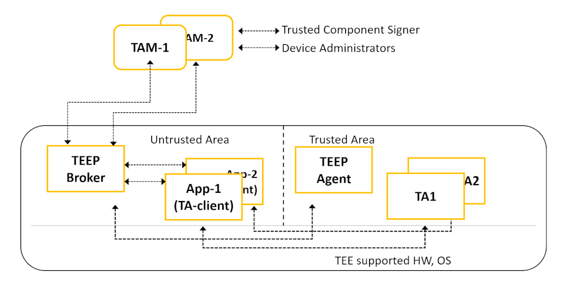

# Overview of TEEP-Device

The TEEP Protocol provides the protocol on a wide range of devices for install, update, and delete Trusted Applications and Personalization Data by Trusted Component Signer or Device Administrators who host Trusted Application Managers (TAMs).



The TEEP-Device is an implementation for defining the draft of Trusted Execution Environment Provisioning (TEEP) Protocol at the Internet Engineering Task Force (IETF). The chart above is a simplified diagram of components described in the TEEP Protocol and TEEP Architecture drafts. The TEEP Protocol on the TEEP-Device uses HTTP packets defined by HTTP Transport for Trusted Execution Environment Provisioning.

Following are the explanation of each components on the above diagram.

Trusted Application (TA): An application that runs in a TEE.

Trusted Application Manager (TAM): An entity that manages Trusted
      Applications and other Trusted Components running in TEEs of
      various devices.

TEEP Broker: A TEEP Broker is an application component running in
      a Rich Execution Environment (REE) that enables the message
      protocol exchange between a TAM and a TEE in a device.  A TEEP
      Broker does not process messages on behalf of a TEE, but merely is
      responsible for relaying messages from the TAM to the TEE, and for
      returning the TEE's responses to the TAM.

TEEP Agent: The TEEP Agent is a processing module running inside a
      TEE that receives TAM requests (typically relayed via a TEEP
      Broker that runs in an REE).  A TEEP Agent in the TEE may parse
      requests or forward requests to other processing modules in a TEE,
      which is up to a TEE provider's implementation.

More details can be found in the below URL.
- TEEP Protocol
  * https://datatracker.ietf.org/doc/html/draft-ietf-teep-protocol
- HTTP Transport for Trusted Execution Environment Provisioning
  * https://datatracker.ietf.org/doc/html/draft-ietf-teep-otrp-over-http
- TEEP Architecutre:
  * https://datatracker.ietf.org/doc/draft-ietf-teep-architecture/

The terminology of Trusted Application (TA) in the old draft was changed to Trusted Component (TC) to express the files installed from TAM to devices that could have both binaries of trusted applications and data files of personalization data. The TA and TC are interchangeable in this documentation.

Typical use cases for TEEP Protocol is a firmware update Over The Air (OTA) which TC containing a firmware binary, installing security sensitive applications used for payment, playing video with DRM, insurance software, enabling hardware feature with license keys, telemetry software, and softwares handles personal identification data, such as Social Security Number, and vaccination status.

## Features of TEEP-Device

- The TEEP Protocol defines the protocol format and interaction between the server called Trusted Application Managers (TAM) and the IoT/Edge devices. The TEEP-Device is an implementation of Trusted Execution Environment Provisioning (TEEP) Protocol on the IoT/Edge devices.

- The TEEP-Device provides the requirements of the TEEP-Broker and TEEP-Agent in IETF drafts.

- Uses the tamproto as an implementation of the TAM server.
  * https://github.com/ko-isobe/tamproto

- Provides initiating the protocol from TEEP-Device, downloading a Trusted Components (TC) called Hello-TEEP-TA as a sample of TC from the TAM, installing it inside TEE, and executing the Hello-TEEP-TA.

- Implemented on top of TA-Ref which provides a portable TEE programming environment among different TEEs on Intel CPU, ARM Cortex-A and RISC-V 64G to provide uniform source codes over OP-TEE on ARM-TrustZone for Cortex-A series and Keystone on RISC-V.

- The required features of TEEP-Agent in the draft is implemented as a application in user application privilege level inside TEE in this TEEP-Device to simplify the implementation which ideally should be combined with implementation in higher privilege levels, such as, the runtime in S-Mode and Secure Monitor in M-mode on RISC-V. Therefore, some of the assumed requirements on the draft are not fulfilled with the TEEP-Device. In the product, the features of TEEP-Agent must be enabled through root-of-trust from the boot up of the CPUs, the TCs must be saved in secure manner and have protection of installed TCs.

- Supports Concise Binary Object Representation (CBOR) for current four TEEP messages.
  * https://datatracker.ietf.org/doc/html/rfc7049

- Supports SUIT-manifest inside the Update message of TEEP Protocol.
  * https://datatracker.ietf.org/doc/draft-ietf-suit-manifest/

## Components of TEEP-Device and TA-Ref

The Trusted Application Reference (TA-Ref) is a different software stack from this TEEP-Devie. The TA-Ref provides portable API and SDK among Intel SGX, ARM TrustZone-A and RISC-V Keystone and enables portability for source codes of Trusted Applications among different CPUs.

The API of TA-Ref is a subset of TEE Internal Core API Specification defined by Global Platform.
 - https://globalplatform.org/specs-library/tee-internal-core-api-specification/

### TEEP-Device and TA-Ref Components on Keystone


The TEEP-Device is implemented on top of the TA-Ref with TEE provided by the Keystone project on RISC-V RV64GC CPU. Each TA in the Trusted Area is protected with Physical memory protection (PMP) which is enabled by RISC-V hardware.

- Keystone project
  * https://keystone-enclave.org/

### TEEP-Device and TA-Ref Components on OP-TEE


It is on OP-TEE but highly utilizes the programming environment provided by TA-Ref to simplify the TEEP-Device to be able to build and function on other CPUs with the single source code of TEEP-Agent and Hello-TEEP-TA. They both are using the subset of Global Platform API.

### TEEP-Device and TA-Ref Components on SGX


The diagram is the ideal implementation of TEEP-Device on SGX. The current TEEP-Device is not utilizing SGX libraries and the SGX enabled CPU which provides SGX capability with SGX SDK. The TEEP-Device is built and executed as a regular user space application at the moment, and enabling the SGX capability is a future activity.

## Directory structure

```
.
+-- README.md
+-- docs                --- Files for generating documentations
+-- hello-app           --- Sample Trusted Application on Linux side for TEEP Protocol
+-- hello-ta            --- Sample Trusted Application on TEE side for TEEP Protocol
+-- include             --- Header files to build hello-app/ta and teep-broker-app/teep-agent-ta
+-- key                 --- Cryptographic keys for TEEP Protocol
+-- libteep             --- Contains libraries used on TEEP-Device
|   +-- libwebsockets   --- HTTP/HTTPS library  https://github.com/warmcat/libwebsockets
|   +-- mbedtls         --- Cryptographic library  https://github.com/ARMmbed/mbed-crypto
|   +-- QCBOR           --- CBOR library  https://github.com/laurencelundblade/QCBOR.git
|   +-- t_cose          --- COSE library  https://github.com/laurencelundblade/t_cose.git
+-- pctest              --- TEEP-Device runs only on PC with Linux for development purpose
+-- platform            --- Build files for supported CPUs
+-- scripts             --- Scripts used for build and running TEEP-Device
+-- teep-agent-ta       --- Main body of handling TEEP Protocol on TEE side
+-- teep-broker-app     --- Main body of handling TEEP Protocol on Linux side
+-- tiny-tam            --- Small TAM implementation
```
# Building TEEP-Device with docker

We have prepared Docker images to provide the environment of building and developing TEEP-Device to reduce the overhead of preparing them individually.

The TEEP-Device requires TA-Ref which provides a unified SDK among different TEEs for three CPU architectures, Keystone for RISC-V, OP-TEE for Arm64 and SGX for Intel.

Without the prepared docker images, the developer will be required to build a massing software stack of Keystone, OP-TEE and SGX and install them on his/her development machine which needs downloading large sizes of source codes, a long time for building them. Also it may result in every individual having a slightly different environment which makes it difficult to reproduce when encountering errors.

The Docker images provide an easy to prepare development environment for TEEP-Device.

## Preparation for Docker

For building TEEP-Device with docker, it is required to install docker on Ubuntu.

For the first time users of docker, please have a look on https://docs.docker.com/engine/

The following installation steps is for Ubuntu 20.04

### Installing Docker

```sh
$ sudo apt update

# Next, install a few prerequisite packages which let apt use packages over HTTPS:
$ sudo apt install apt-transport-https ca-certificates curl software-properties-common

# Then add the GPG key for the official Docker repository to your system:
$ curl -fsSL https://download.docker.com/linux/ubuntu/gpg | sudo apt-key add -

# Add the Docker repository to APT sources:
$ sudo add-apt-repository "deb [arch=amd64] https://download.docker.com/linux/ubuntu focal stable"

# This will also update our package database with the Docker packages from the newly added repo.
# Make sure you are about to install from the Docker repo instead of the default Ubuntu repo:
$ apt-cache policy docker-ce

#Finally, install Docker
$ sudo apt install docker-ce
```

### Executing Docker without sudo

By default, the docker command can only be run by the root user or by a user in the docker group, which is automatically created during Docker's installation process. If you attempt to run the docker command without prefixing it with sudo or without being in the docker group, you will get an output like this:

```console
docker: Cannot connect to the Docker daemon. Is the docker daemon running on this host?.
```

To avoid typing sudo whenever we run the docker command, add your username to the docker group.

```sh
$ sudo groupadd docker

$ sudo gpasswd -a $USER docker

# Logout and then log-in again to apply the changes to the group
 ```

After you logout and login, you can probably run the docker command without `sudo`.

```sh
$ docker run hello-world
```

### Create a Docker network tamproto

A Docker network named tamproto is required when we run TEEP-Device. The local network is required to connect with tamproto service running locally.

```sh
$ docker network create tamproto_default
```


## Pre-built Docker Images without necessity of building

The following are the docker images that have pre-built and tested binaries of TEEP-Device with TA-Ref. Since these images are already prepared and built already, you can start using it directly without building the TEEP-Device again.

Make sure you have an account on docker-hub. If not please create one on `dockerhub.com`

| Target | docker image |
| ------ | ------ |
| Keystone | aistcpsec/teep-dev:keystone |
| OP-TEE | aistcpsec/teep-dev:optee |
| Intel SGX | aistcpsec/teep-dev:sgx |
| Tamproto | aistcpsec/teep-dev:tamproto |
| Doxygen | aistcpsec/teep-dev:doxygen |


## Preparation for building TEEP-Device on Docker

### Docker images details for building

We use Docker images of TA-Ref for building the TEEP-Device since TEEP-Device is developed on top of TA-Ref SDK.

Docker images with all necessary packages for building TEEP-Device for all three targets are already available. The details are mentioned below.


| Target | docker image |
| ------ | ------ |
| Keystone | aistcpsec/taref-dev:keystone |
| OP-TEE | aistcpsec/taref-dev:optee |
| Intel SGX | aistcpsec/taref-dev:sgx |
| Doxygen | aistcpsec/taref-dev:doxygen |


## Building TEEP-Device with Docker

The build environment is in three terminals for convenient development.

* Terminal of running tamproto
    - Shows log messages of tamproto while developing TEEP-Device

* Terminal of running Docker of TEE
    - For building and manipulating TEEP-Device

* Terminal of editing TEEP-Device
    - For editing source codes of TEEP-Device by watching the above two terminals.

The terminals may be a local fast computer or login with ssh to a remote build machine with each terminal. In any case, the speed of the build machine affects the efficiency of the development.


### Building TEEP-Device for Keystone with Docker

Following commands are to be executed on Ubuntu 20.04.

To run TEEP-Device, first we need to run tamproto inside the same host. Let's clone the tamproto and start it.

**Running tamproto**

Open the first terminal for the tamproto.

```sh
# Clone the tamproto repo and checkout master branch
$ git clone https://192.168.100.100/rinkai/tamproto.git
$ cd tamproto
$ git checkout master
$ docker-compose build
$ docker-compose up &
$ cd ..
```

Trimmed output of starting tamproto
```console
tam_api_1  |   TEE_pub: 'teep.jwk' }
tam_api_1  | Load key TAM_priv
tam_api_1  | Load key TAM_pub
tam_api_1  | Load key TEE_priv
tam_api_1  | Load key TEE_pub
tam_api_1  | Key binary loaded
tam_api_1  | 192.168.11.4
tam_api_1  | Express HTTP  server listening on port 8888
tam_api_1  | Express HTTPS server listening on port 8443
```

**Cloning TEEP-Device**

Open the second terminal for editing the sources of TEEP-Device. The directory of cloning sources is mounted when running Docker in the next step.

```sh
# Clone the teep-device repo and checkout master branch
$ git clone https://192.168.100.100/rinkai/teep-device.git
$ cd teep-device
$ git checkout master

# Sync and update the submodules
$ git submodule sync --recursive
$ git submodule update --init --recursive
```

**Start the Docker**

Open the third terminal. Here we build the TEEP-Device and run it to talk with tamproto opened on the first terminal. If any error occurs, edit the sources on the second terminal to debug.

```sh
# Start the docker
$ docker run --network tamproto_default -it --rm -v $(pwd):/home/user/teep-device aistcpsec/taref-dev:keystone
```

After you start the docker command, you will be logged-in inside the docker container.
Following are the  commands to be executed inside the docker.

```sh
# [Inside docker image]

# Change to teep-device
$ cd ~/teep-device/

# Build the teep-device
$ make
```

After the successful build, run the sample TEEP session with tamproto.

```sh
$ make run-sample-session

```

Trimmed output printing 'Hello TEEP from TEE!'

```sh
Welcome to Buildroot
buildroot login: root
Password: sifive

#### insmod keystone-driver.ko || echo 'err''or'
[    5.350967] keystone_driver: loading out-of-tree module taints kernel.
[    5.358283] keystone_enclave: keystone enclave v1.0.0
#### cd /root/teep-device
#### ls -l
total 1367
-rwxr-xr-x    1 root     root         98088 Feb 15  2022 eyrie-rt
-rwxr-xr-x    1 root     root        437480 Feb 15  2022 hello-app
-rwxr-xr-x    1 root     root        152016 Feb 15  2022 hello-ta
-rwxr-xr-x    1 root     root        247416 Feb 15  2022 teep-agent-ta
-rwxr-xr-x    1 root     root        470568 Feb 15  2022 teep-broker-app
#### ./hello-app hello-ta eyrie-rt
[debug] UTM : 0xffffffff80000000-0xffffffff80100000 (1024 KB) (boot.c:127)
[debug] DRAM: 0x179800000-0x179c00000 (4096 KB) (boot.c:128)
[debug] FREE: 0x1799bd000-0x179c00000 (2316 KB), va 0xffffffff001bd000 (boot.c:133)
[debug] eyrie boot finished. drop to the user land ... (boot.c:172)

Hello TEEP from TEE!

#### ./hello-app 8d82573a-926d-4754-9353-32dc29997f74.ta eyrie-rt
[Keystone SDK] /home/user/keystone/sdk/src/host/ElfFile.cpp:26 : file does not exist - 8d82573a-926d-4754-9353-32dc29997f74.ta
[Keystone SDK] /home/user/keystone/sdk/src/host/Enclave.cpp:209 : Invalid enclave ELF
./hello-app: Unable to start enclave

#### ./teep-broker-app --tamurl http://tamproto_tam_api_1:8888/api/tam_cbor
teep-broker.c compiled at Feb 15 2022 10:07:55
uri = http://tamproto_tam_api_1:8888/api/tam_cbor, cose=0, talist=
[debug] UTM : 0xffffffff80000000-0xffffffff80100000 (1024 KB) (boot.c:127)
[debug] DRAM: 0x179800000-0x179c00000 (4096 KB) (boot.c:128)
[debug] FREE: 0x1799c6000-0x179c00000 (2280 KB), va 0xffffffff001c6000 (boot.c:133)
[debug] eyrie boot finished. drop to the user land ... (boot.c:172)
<output trimmed>
command: 20
execute suit-set-parameters
command: 1
execute suit-condition-vendor-identifier
command: 2
execute suit-condition-class-identifier
command: 19
execute suit-set-parameters
command: 21
execute suit-directive-fetch
fetch_and_store component
[1970/01/01 00:00:07:8189] NOTICE: GET:
http://tamproto_tam_api_1:8888/TAs/8d82573a-926d-4754-9353-32dc29997f74.ta
[1970/01/01 00:00:07:8204] NOTICE: created client ssl context for default
[1970/01/01 00:00:07:8211] NOTICE:
http://tamproto_tam_api_1:8888/TAs/8d82573a-926d-4754-9353-32dc29997f74.ta
component download 152016
store component
  device   = TEEP-Device
  storage  = SecureFS
  filename = 8d82573a-926d-4754-9353-32dc29997f74.ta
finish fetch
command: 3
execute suit-condition-image-match
end of command seq
[1970/01/01 00:00:08:4271] NOTICE: POST: http://tamproto_tam_api_1:8888/api/tam_cbor
[1970/01/01 00:00:08:4276] NOTICE:
[1970/01/01 00:00:08:4280] NOTICE: 0000: 82 05 A1 14 48 77 77 77 77 77 77 77 77             ....Hwwwwwwww
[1970/01/01 00:00:08:4287] NOTICE:
[1970/01/01 00:00:08:4297] NOTICE: created client ssl context for default
[1970/01/01 00:00:08:4303] NOTICE: http://tamproto_tam_api_1:8888/api/tam_cbor
[1970/01/01 00:00:08:4563] NOTICE: (hexdump: zero length)
#### ls -l
total 1517
-rw-------    1 root     root        152016 Jan  1 00:00 8d82573a-926d-4754-9353-32dc29997f74.ta
-rwxr-xr-x    1 root     root         98088 Feb 15  2022 eyrie-rt
-rwxr-xr-x    1 root     root        437480 Feb 15  2022 hello-app
-rwxr-xr-x    1 root     root        152016 Feb 15  2022 hello-ta
-rwxr-xr-x    1 root     root        247416 Feb 15  2022 teep-agent-ta
-rwxr-xr-x    1 root     root        470568 Feb 15  2022 teep-broker-app
#### ./hello-app 8d82573a-926d-4754-9353-32dc29997f74.ta eyrie-rt
[debug] UTM : 0xffffffff80000000-0xffffffff80100000 (1024 KB) (boot.c:127)
[debug] DRAM: 0x179800000-0x179c00000 (4096 KB) (boot.c:128)
[debug] FREE: 0x1799bd000-0x179c00000 (2316 KB), va 0xffffffff001bd000 (boot.c:133)
[debug] eyrie boot finished. drop to the user land ... (boot.c:172)

Hello TEEP from TEE!

97f74.ta.secstor.plain-4754-9353-32dc29997f74.ta 8d82573a-926d-4754-9353-32dc2999
cmp: 8d82573a-926d-4754-9353-32dc29997f74.ta.secstor.plain: No such file or directory
####  done
```

Cleaning built binaries. Deleting the built binaries are required when starting to build TEEP-Device on other CPU architectures otherwise will generate errors.

```sh
$ make clean
```


### Building TEEP-Device for OP-TEE with docker

To run TEEP-Device, first we need to run tamproto inside the same host. Let's clone the tamproto and start it.

**tamproto**

```sh
# Clone the tamproto repo and checkout master branch
$ git clone https://192.168.100.100/rinkai/tamproto.git
$ cd tamproto
$ git checkout master
$ docker-compose build
$ docker-compose up &
$ cd ..
```

Trimmed output of starting tamproto
```console
tam_api_1  |   TEE_pub: 'teep.jwk' }
tam_api_1  | Load key TAM_priv
tam_api_1  | Load key TAM_pub
tam_api_1  | Load key TEE_priv
tam_api_1  | Load key TEE_pub
tam_api_1  | Key binary loaded
tam_api_1  | 192.168.11.4
tam_api_1  | Express HTTP  server listening on port 8888
tam_api_1  | Express HTTPS server listening on port 8443
```

**TEEP-Device**

```sh
# Clone the teep-device repo and checkout master branch
$ git clone https://192.168.100.100/rinkai/teep-device.git
$ cd teep-device
$ git checkout master

# Sync and update the submodules
$ git submodule sync --recursive
$ git submodule update --init --recursive
```

**Start the Docker**

```sh
# Start the Docker
$ docker run --network tamproto_default -it --rm -v $(pwd):/home/user/teep-device aistcpsec/taref-dev:optee
```

After you start the docker command, you will be logged-in inside the docker container.
Following are the commands to be executed inside the docker.

```sh
# [Inside docker image]

# Change to teep-device
$ cd ~/teep-device/

# Build the teep device
$ make
```

After the successful build, run the sample TEEP session with tamproto.

```sh
# After the successful build
# Run the TEEP-Device
$ make run-sample-session
```

Trimmed output of the test

```console
M/TA: command: 20
M/TA: execute suit-set-parameters
M/TA: command: 1
M/TA: execute suit-condition-vendor-identifier
M/TA: command: 2
M/TA: execute suit-condition-class-identifier
M/TA: command: 19
M/TA: execute suit-set-parameters
M/TA: command: 21
M/TA: execute suit-directive-fetch
M/TA: fetch_and_store component
M/TA: component download 55976
M/TA: store component
M/TA:   device   = TEEP-Device
M/TA:   storage  = SecureFS
M/TA:   filename = 8d82573a-926d-4754-9353-32dc29997f74.ta
D/TC:? 0 tee_ta_init_pseudo_ta_session:283 Lookup pseudo TA 6e256cba-fc4d-4941-ad09-2ca1860342dd
D/TC:? 0 tee_ta_init_pseudo_ta_session:296 Open secstor_ta_mgmt
D/TC:? 0 tee_ta_init_pseudo_ta_session:310 secstor_ta_mgmt : 6e256cba-fc4d-4941-ad09-2ca1860342dd
D/TC:? 0 install_ta:99 Installing 8d82573a-926d-4754-9353-32dc29997f74
D/TC:? 0 tee_ta_close_session:499 csess 0xc09491c0 id 1
D/TC:? 0 tee_ta_close_session:518 Destroy session
M/TA: finish fetch
M/TA: command: 3
M/TA: execute suit-condition-image-match
M/TA: end of command seq
D/TC:? 0 tee_ta_close_session:499 csess 0xc094ab40 id 1
D/TC:? 0 tee_ta_close_session:518 Destroy session
D/TC:? 0 destroy_context:298 Destroy TA ctx (0xc094aae0)
D/TC:? 0 tee_ta_init_pseudo_ta_session:283 Lookup pseudo TA 8d82573a-926d-4754-9353-32dc29997f74
D/TC:? 0 load_ldelf:704 ldelf load address 0x40006000
D/LD:  ldelf:134 Loading TA 8d82573a-926d-4754-9353-32dc29997f74
D/TC:? 0 tee_ta_init_session_with_context:573 Re-open TA 3a2f8978-5dc0-11e8-9c2d-fa7ae01bbebc
D/TC:? 0 system_open_ta_binary:257 Lookup user TA ELF 8d82573a-926d-4754-9353-32dc29997f74 (Secure Storage TA)
D/TC:? 0 system_open_ta_binary:260 res=0x0
D/LD:  ldelf:169 ELF (8d82573a-926d-4754-9353-32dc29997f74) at 0x40066000
D/TC:? 0 tee_ta_close_session:499 csess 0xc0948820 id 1
D/TC:? 0 tee_ta_close_session:518 Destroy session

Hello TEEP from TEE!

D/TC:? 0 tee_ta_close_session:499 csess 0xc0949020 id 1
D/TC:? 0 tee_ta_close_session:518 Destroy session
D/TC:? 0 destroy_context:298 Destroy TA ctx (0xc0948fc0)
make[1]: Leaving directory '/home/user/teep-device/platform/op-tee'
```

Cleaning built binaries. Deleting the built binaries are required when starting to build TEEP-Device on other CPU architectures otherwise will generate errors.

```sh
$ make clean
```


### Building TEEP-Device for SGX with docker


To run TEEP-Device, first we need to run tamproto inside the same host. Let's clone the tamproto and start it.

**tamproto**

```sh
# Clone the tamproto repo and checkout master branch
$ git clone https://192.168.100.100/rinkai/tamproto.git
$ cd tamproto
$ git checkout master
$ docker-compose build
$ docker-compose up &
$ cd ..
```

Trimmed output of starting tamproto
```console
tam_api_1  |   TEE_pub: 'teep.jwk' }
tam_api_1  | Load key TAM_priv
tam_api_1  | Load key TAM_pub
tam_api_1  | Load key TEE_priv
tam_api_1  | Load key TEE_pub
tam_api_1  | Key binary loaded
tam_api_1  | 192.168.11.4
tam_api_1  | Express HTTP  server listening on port 8888
tam_api_1  | Express HTTPS server listening on port 8443
```

**TEEP-Device**

```sh
# Clone the teep-device repo and checkout master branch
$ git clone https://192.168.100.100/rinkai/teep-device.git
$ cd teep-device
$ git checkout master

# Sync and update the submodules
$ git submodule sync --recursive
$ git submodule update --init --recursive
```

**Start the Docker**

```sh
# Start the Docker
$ docker run --network tamproto_default -it --rm -v $(pwd):/home/user/teep-device aistcpsec/taref-dev:sgx
```

After you start the docker command, you will be logged-in inside the docker container.
Following are the commands to be executed inside the docker

```sh
# [Inside docker image]

# Change to teep-device
$ cd ~/teep-device/

# set the TEE environments for SGX
# The MACHINE=SIM specifies running SGX in simulation mode which
# will allow running SGX on all Intel and AMD cpu regardless of SGX support.
$ export MACHINE=SIM

# Build the teep device
$ make
```

After the successful build, run the sample TEEP session with tamproto.

```sh
# After the successful build
# Run the TEEP-Device
$ make run-sample-session
```

Trimmed output of the run.

```console
-rw-r--r-- 1 build-user build-user 326986 Sep  8 07:01 embed-tc.suit
-rw-r--r-- 1 build-user build-user    209 Sep  8 07:01 embed-tc.suit.tmp
-rw-r--r-- 1 build-user build-user    690 Sep  8 07:01 embed.json
-rw-rw-rw- 1 root       root         1901 Sep  8 07:00 enclave.mk
-rw-r--r-- 1 build-user build-user 326768 Sep  8 07:01 enclave.signed.so
-rwxr-xr-x 1 build-user build-user 326768 Sep  8 07:01 enclave.so
-rw-r--r-- 1 build-user build-user    351 Sep  8 07:01 signed-download-tc.suit
-rw-r--r-- 1 build-user build-user 327062 Sep  8 07:01 signed-embed-tc.suit
cd /builds/rinkai/teep-device/sample/../build/sgx/agent && \
    ../broker/teep-broker-app --tamurl http://172.17.0.26:8888/api/tam_cbor | \
    tee /builds/rinkai/teep-device/sample/../build/sgx/sgx.log
[CEnclavePool /home/user/linux-sgx/psw/urts/enclave.cpp:627] enter CEnclavePool constructor
[build_secs /home/user/linux-sgx/psw/urts/loader.cpp:516] Enclave start addr. = 0x7f011e616000, Size = 0x8000000, 131072 KB
verifying signature of suit manifest
verify OK
command: 20
execute suit-set-parameters
command: 1
execute suit-condition-vendor-identifier
command: 2
execute suit-condition-class-identifier
command: 19
execute suit-set-parameters
command: 21
execute suit-directive-fetch
fetch_and_store component
component download 326768
store component
  device   = TEEP-Device
  storage  = SecureFS
  filename = 8d82573a-926d-4754-9353-32dc29997f74.ta
finish fetch
command: 3
execute suit-condition-image-match
end of command seq
cd /builds/rinkai/teep-device/sample/../build/sgx/../../hello-tc/build-sgx/ && \
    ./App_sgx | \
    tee -a /builds/rinkai/teep-device/sample/../build/sgx/sgx.log
[CEnclavePool /home/user/linux-sgx/psw/urts/enclave.cpp:627] enter CEnclavePool constructor
[build_secs /home/user/linux-sgx/psw/urts/loader.cpp:516] Enclave start addr. = 0x7f8173294000, Size = 0x8000000, 131072 KB
main start
Hello TEEP from TEE!
main end
Info: Enclave successfully returned.
```

Cleaning built binaries. Deleting the built binaries are required when starting to build TEEP-Device on other CPU architectures otherwise will generate errors.

```sh
$ make clean
```


# Building TEEP-Device for PC without docker

The building PC is prepared for debugging purposes during developing TEEP-Device itself. This method does not require any TEEs installed in the local machine and it is meant to build and run on TEEP-Device on any x64 PC.

To run TEEP-Device, first we need to run tamproto inside the same host. Let's clone the tamproto and start it.

**tamproto**

```sh
# Clone the tamproto repo and checkout master branch
$ git clone https://192.168.100.100/rinkai/tamproto.git
$ cd tamproto
$ git checkout master
$ docker-compose build
$ docker-compose up &
$ cd ..
```

Trimmed output of starting tamproto
```console
tam_api_1  |   TEE_pub: 'teep.jwk' }
tam_api_1  | Load key TAM_priv
tam_api_1  | Load key TAM_pub
tam_api_1  | Load key TEE_priv
tam_api_1  | Load key TEE_pub
tam_api_1  | Key binary loaded
tam_api_1  | 192.168.11.4
tam_api_1  | Express HTTP  server listening on port 8888
tam_api_1  | Express HTTPS server listening on port 8443
```

**TEEP-Device**

```sh
# Clone the teep-device repo and checkout master branch
$ git clone https://192.168.100.100/rinkai/teep-device.git
$ cd teep-device
$ git checkout master

# Sync and update the submodules
$ git submodule sync --recursive
$ git submodule update --init --recursive
```

**Build**

```sh
# Change to teep-device
$ cd ~/teep-device/

# set the TEE environment to PC which do not use any of TEEs
$ export TEE=pc

# Build the teep device
$ make
```

After the successful build, run the sample TEEP session with tamproto.

```sh
# After the successful build
# Run the TEEP-Device
$ make run-sample-session
```

Trimmed output of the run.
The output can be found in /home/user/teep-device/platform/pc/build/8d82573a-926d-4754-9353-32dc29997f74.ta


```console
build-user@c4435c23705c:~/teep-device$ ls -l /home/user/teep-device/platform/pc/build/
total 40
-rw-r--r-- 1 build-user build-user   21 Feb 15 10:29 8d82573a-926d-4754-9353-32dc29997f74.ta
-rw-r--r-- 1 build-user build-user  734 Feb 15 10:29 hello-ta.json
-rw-r--r-- 1 build-user build-user  255 Feb 15 10:29 hello-ta.suit
drwxr-xr-x 4 build-user build-user 4096 Feb 15 10:28 libteep
-rw-r--r-- 1 build-user build-user 5198 Feb 15 10:29 pctest.log
drwxr-xr-x 2 build-user build-user 4096 Feb 15 10:28 scripts
-rw-r--r-- 1 build-user build-user  357 Feb 15 10:29 signed-hello-ta-payload.suit
-rw-r--r-- 1 build-user build-user  331 Feb 15 10:29 signed-hello-ta.suit
drwxr-xr-x 2 build-user build-user 4096 Feb 15 10:28 teep-broker-app

build-user@c4435c23705c:~/teep-device$ cat /home/user/teep-device/platform/pc/
build/8d82573a-926d-4754-9353-32dc29997f74.ta
Hello TEEP from TEE!
```
